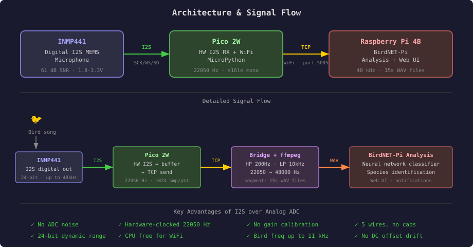
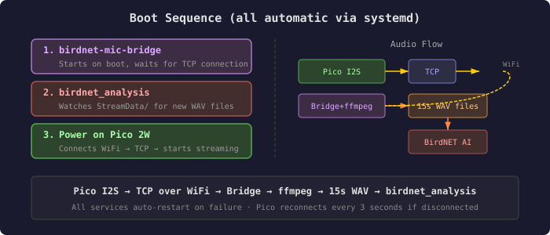
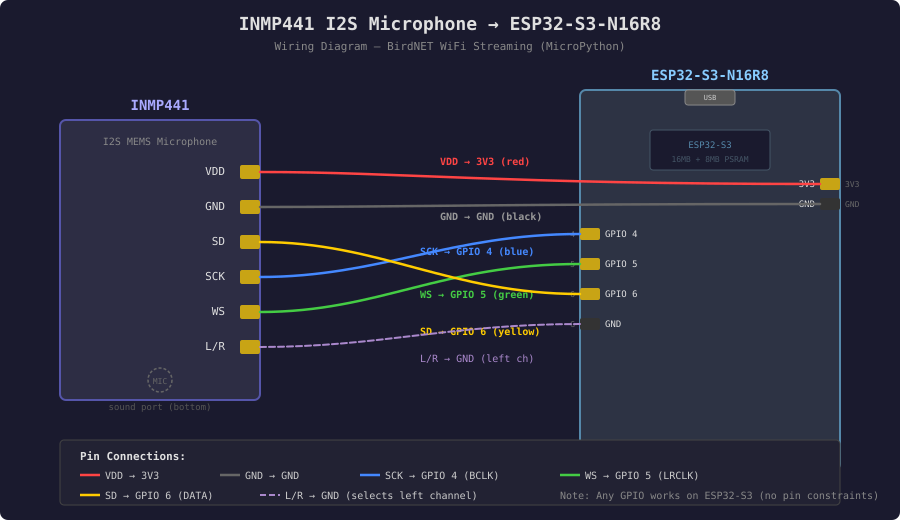
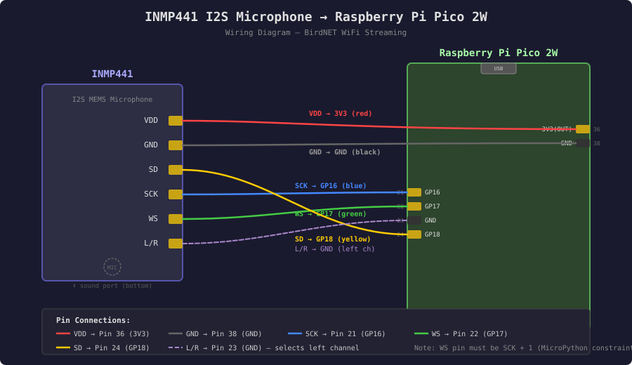
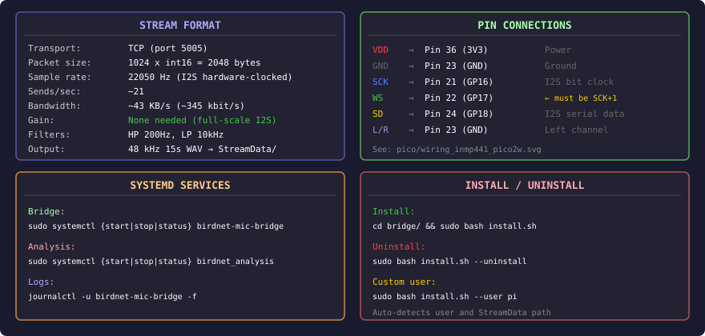

# Wireless Microphone Streaming to BirdNET-Pi

> **Build Guide** — Stream audio from an INMP441 I2S MEMS mic over WiFi to a Raspberry Pi 4B running [BirdNET-Pi](https://github.com/Nachtzuster/BirdNET-Pi) for realtime bird classification.

Two microcontroller platforms supported:

| Platform | Best for |
|----------|----------|
| **ESP32-S3-N16R8** | Reliable WiFi, flexible I2S pins, more RAM — recommended for new builds |
| **Pico 2W** | Ultra-cheap, works well with optimal router settings |

**Stack:** `ESP32-S3 or Pico 2W (MicroPython)` · `Pi 4B (BirdNET-Pi)` · `INMP441 I2S` · `TCP → direct WAV`

---

## Contents

1. [How it works](#1-how-it-works)
2. [Platform comparison](#2-platform-comparison-esp32-s3-vs-pico-2w)
3. [What you need](#3-what-you-need)
4. [Microphone specs](#4-microphone-specs)
5. [Wiring — ESP32-S3](#5-wiring-inmp441-to-esp32-s3)
6. [Wiring — Pico 2W](#6-wiring-inmp441-to-pico-2w)
7. [ESP32-S3 firmware](#7-esp32-s3-firmware)
8. [Pico 2W firmware](#8-pico-2w-firmware)
9. [Pi 4B setup (bridge)](#9-pi-4b-setup)
10. [Running it](#10-running-it)
11. [Troubleshooting](#11-troubleshooting)
12. [Appendix: Why INMP441?](#appendix-why-inmp441)

---

## 1. How it works

The INMP441 is a **digital I2S microphone** — it outputs a clocked digital bitstream, not an analog voltage. The microcontroller's hardware I2S peripheral captures audio data directly into memory buffers at 22050 Hz. The CPU is free for WiFi — no manual ADC timing or gain calibration needed.

On the Pi, a **bridge service** accepts the TCP connection, pipes the audio through `ffmpeg` for gentle filtering (high-pass at 200 Hz, low-pass at 10 kHz) and resampling (22050 Hz → 48 kHz), and writes **15-second WAV files** directly to BirdNET-Pi's `StreamData` folder. The **analysis service** picks up each new WAV file and runs it through the BirdNET neural network for species identification.

### Architecture



### Boot Sequence



---

## 2. Platform comparison: ESP32-S3 vs Pico 2W

### Why ESP32-S3 is the recommended platform

| Aspect | ESP32-S3-N16R8 | Pico 2W |
|--------|----------------|---------|
| **WiFi stability** | Rock-solid — mature ESP-IDF radio stack, rarely drops | CYW43439 chip is sensitive to channel/bandwidth settings; can stall on channels 12+ or 40 MHz mode |
| **WiFi throughput** | Consistently 40+ KB/s for this workload | 15–31 KB/s depending on router config |
| **I2S flexibility** | Any GPIO for SCK/WS/SD | WS must be exactly SCK+1 (MicroPython constraint) |
| **CPU** | 240 MHz dual-core | 150 MHz dual-core |
| **RAM** | 512 KB SRAM + 8 MB PSRAM | 520 KB SRAM (no PSRAM) |
| **I2S mode** | Mono direct — simpler, less bandwidth | Stereo framing required → extract left channel in software |
| **Power management** | `PM_NONE` — straightforward | Requires `config(pm=...)` tuning and `rp2.country()` |
| **5 GHz WiFi** | No (2.4 GHz only) | No (2.4 GHz only) |
| **Price** | ~$5–8 | ~$6 |
| **Status LED** | NeoPixel RGB (built-in on most boards) | Single green LED |

### Known Pico 2W WiFi limitations

The Pico 2W uses the **CYW43439** WiFi/BT chip. While functional for this project, it has notable quirks:

- **Channel sensitivity** — channels 12 and 13 cause poor throughput or complete stalls on some firmware versions. Stick to channels 1, 6, or 11.
- **40 MHz bandwidth penalty** — the radio performs worse at 40 MHz channel width; switching to 20 MHz doubled throughput in testing (15–20 KB/s → 31 KB/s).
- **Partial sends** — `sock.send()` may not transmit the full buffer. The firmware must handle partial writes and retry, or audio underruns on the bridge side.
- **No idle yield = WiFi starvation** — the TCP send loop must call `idle()` to give the radio stack processing time; omitting it causes silent packet loss.
- **Power management defaults** — without explicit `config(pm=0xa11140)` the chip aggressively sleeps, causing multi-second TCP stalls.

If you already have a Pico 2W, it works fine with the right router settings (see [Troubleshooting](#wifi-router-settings-important-for-pico-2w-stability)). For new builds, the ESP32-S3 avoids all of the above.

---

## 3. What you need

### Hardware (pick one microcontroller)

**Option A — ESP32-S3 (recommended):**
- **ESP32-S3-N16R8** board (16 MB Flash, 8 MB PSRAM, ~$5–8)
- **INMP441** I2S MEMS Microphone module (~$2–5)
- 5 jumper wires
- USB-C cable

**Option B — Pico 2W:**
- Raspberry Pi **Pico 2W** (the W variant with WiFi)
- **INMP441** I2S MEMS Microphone module (~$2–5)
- 5 jumper wires
- Micro-USB cable

**Shared:**
- Raspberry Pi **4B** — already on your WiFi network
- Breadboard (optional, for prototyping)

### Software

- [BirdNET-Pi](https://github.com/Nachtzuster/BirdNET-Pi) installed on the Pi 4B
- MicroPython firmware on the microcontroller
- [Thonny](https://thonny.org) or `mpremote` to upload code
- `ffmpeg` on the Pi (included with BirdNET-Pi)

---

## 4. Microphone specs

### INMP441 — Key parameters

| Parameter            | Value                                           |
| -------------------- | ----------------------------------------------- |
| Interface            | I2S (digital) — SCK, WS, SD                    |
| Supply voltage (VDD) | 1.8V – 3.3V → use board's **3.3V** output      |
| Current draw         | ~1.4 mA                                         |
| SNR                  | 61 dB(A)                                        |
| Sensitivity          | -26 dBFS                                        |
| Frequency range      | 60 Hz – 15 kHz                                  |
| Data format          | 24-bit I2S, MSB-first, requires 64 SCK/frame   |
| Channel select (L/R) | Low = left channel, High = right channel        |
| Sample rates         | Up to 48 kHz (we use 22050 Hz)                  |

> **Tip:** The 60 Hz – 15 kHz range easily covers typical bird vocalizations (1 kHz – 10 kHz). At 22050 Hz sample rate, we capture frequencies up to ~11 kHz — more than enough for most species.

### Why I2S beats analog ADC for this project

| Aspect           | Analog (SPH8878LR5H-1 + ADC) | Digital (INMP441 I2S)       |
| ---------------- | ----------------------------- | --------------------------- |
| Noise floor      | ADC + WiFi switching noise    | Clean digital signal        |
| Sample rate      | 16 kHz max (MicroPython CPU)  | 22050+ Hz (hardware PIO)   |
| Gain calibration | Required (DC offset + gain)   | Not needed                  |
| Wiring           | 3 wires + 2 caps recommended  | 5 wires, no caps            |
| Dynamic range    | 12-bit effective              | 24-bit from mic             |
| CPU load         | High (manual timing loop)     | Low (DMA fills buffer)      |

---

## 5. Wiring: INMP441 to ESP32-S3



### Pin mapping

| INMP441 Pin | ESP32-S3 Pin | Function            |
|-------------|--------------|---------------------|
| **VDD**     | 3V3          | Power (3.3V)        |
| **GND**     | GND          | Ground              |
| **SCK**     | GPIO 4       | I2S Bit Clock       |
| **WS**      | GPIO 5       | I2S Word Select     |
| **SD**      | GPIO 6       | I2S Data Out        |
| **L/R**     | GND          | Left channel select |

> **Note:** Any GPIO works on ESP32-S3 for I2S — there's no WS=SCK+1 constraint like on the Pico. If GPIO 4/5/6 are unavailable on your board, change `I2S_SCK`, `I2S_WS`, `I2S_SD` in `main.py`.

> **Tip:** Keep wires short (< 10 cm) to avoid noise on the I2S bus.

> **Important:** The L/R pin **must** be connected to GND (not left floating). A floating L/R pin causes the mic to produce no audio output.

### WiFi noise mitigation (software)

The ESP32's WiFi radio can inject impulsive noise (clicks) into the I2S data path. The firmware includes two software countermeasures:

- **Slew-rate limiter** — caps maximum sample-to-sample change to ±3000, suppressing single-sample spikes from WiFi TX bursts
- **DC-blocking high-pass filter** — removes sub-38 Hz rumble and DC offset

The bridge additionally runs ffmpeg's `adeclick` filter to catch any remaining impulses.

> **Note:** A decoupling capacitor across INMP441 VDD/GND is often recommended, but on breakout boards with long leads it can create LC oscillation and make noise worse. Only add one if you can solder an SMD cap directly at the INMP441 IC pads.

---

## 6. Wiring: INMP441 to Pico 2W

Five signal connections plus one channel-select tie to ground. No decoupling capacitors needed — the INMP441 is a digital device.



### Pin mapping

| INMP441 pin | Pico 2W pin         | Wire      | Notes                                          |
| ----------- | ------------------- | --------- | ---------------------------------------------- |
| **VDD**     | Pin 36 — 3V3(OUT)   | Red       | 3.3V supply. Range: 1.8V – 3.3V               |
| **GND**     | Pin 23 — GND        | Black     | Ground                                         |
| **SCK**     | Pin 21 — GP16       | Blue      | I2S serial clock (bit clock)                   |
| **WS**      | Pin 22 — GP17       | Green     | I2S word select (LRCLK). **Must be SCK + 1**  |
| **SD**      | Pin 24 — GP18       | Yellow    | I2S serial data output                         |
| **L/R**     | Pin 23 — GND        | (jumper)  | Tied low = output on left channel              |

> **Important:** On the Pico 2W with MicroPython, the WS pin number **must** be exactly one greater than the SCK pin number. GP16/GP17 satisfies this constraint.

> **Important:** The L/R pin **must** be connected to GND (not left floating). A floating L/R pin causes the mic to produce no audio output.

> **Tip:** The INMP441's sound port (tiny hole) is on the **bottom** of the module. When mounting, ensure nothing covers the underside.

### WiFi noise mitigation (software)

The Pico 2W's CYW43439 WiFi chip communicates over SPI, injecting **multi-sample** noise bursts into the I2S data path (unlike the ESP32's single-sample spikes). The firmware uses a different strategy:

- **Spike detection + blanking window** — when a sample-to-sample delta exceeds ±1500, the output holds the last known good value for 8 consecutive samples (~0.5ms), covering the full SPI transaction burst
- **DC-blocking high-pass filter** — removes sub-38 Hz rumble and DC offset
- **Reduced TX power** (8 dBm) — less radiated energy = smaller SPI bursts

The bridge additionally runs ffmpeg's `adeclick` filter as a second layer.

| Interference type | ESP32-S3 | Pico 2W |
|-------------------|----------|---------|
| Source | On-die RF coupling | SPI bus to CYW43439 |
| Pattern | Single-sample spikes | Multi-sample bursts |
| Fix | Slew-rate clamp (±3000) | Blanking window (8 samples) |

---

## 7. ESP32-S3 firmware

### Installing MicroPython

Official builds for ESP32-S3 with OctalSPI PSRAM (N16R8):

**Download:** https://micropython.org/download/ESP32_GENERIC_S3/

Pick the firmware file ending in `ESP32_GENERIC_S3-SPIRAM_OCT-20xxxxxx-vX.X.X.bin` — the `SPIRAM_OCT` variant is required for boards with 8 MB octal PSRAM.

#### Flash via esptool

1. Install esptool:
   ```bash
   pip install esptool
   ```

2. Put the board in download mode: hold **BOOT** → press **RESET** → release **BOOT**

3. Erase flash:
   ```bash
   esptool.py --chip esp32s3 --port /dev/ttyACM0 erase_flash
   ```

4. Flash MicroPython:
   ```bash
   esptool.py --chip esp32s3 --port /dev/ttyACM0 write_flash -z 0 ESP32_GENERIC_S3-SPIRAM_OCT-20xxxxxx-vX.X.X.bin
   ```

5. Press **RESET** after flashing.

> **macOS:** the port is typically `/dev/cu.usbmodem*` instead of `/dev/ttyACM0`.

#### Flash via Thonny (alternative)

1. Put board in download mode (BOOT + RESET)
2. **Tools → Options → Interpreter → Install or update MicroPython (esptool)**
3. Select: MicroPython family **ESP32-S3**, Variant **Espressif ESP32-S3 (SPIRAM OCT)**
4. Click **Install**, wait, then press **RESET**

### Uploading the firmware

1. Open [Thonny](https://thonny.org) → **Tools → Options → Interpreter** → **MicroPython (ESP32)**
2. Set port:
   - macOS: `/dev/cu.wchusbserial*` or `/dev/cu.usbserial*`
   - Linux: `/dev/ttyUSB0` or `/dev/ttyACM0`
   - Windows: `COM3` (check Device Manager)
3. Open `esp32/main.py` — edit `WIFI_SSID`, `WIFI_PASSWORD`, and `SERVER_IP`
4. **File → Save as → MicroPython device → `main.py`**
5. Press **RESET** or click Run

Alternative with mpremote:
```bash
pip install mpremote
mpremote connect /dev/cu.usbmodem* cp main.py :main.py
mpremote connect /dev/cu.usbmodem* reset
```

### ESP32-S3 documentation (PDF)

- [ESP32-S3-N16R8 User Guide](esp32/ESP32-S3-N16R8_User_Guide.pdf)
- [ESP32-S3-WROOM-1 Datasheet](esp32/esp32-s3-wroom-1_wroom-1u_datasheet_en.pdf)
- [ESP32-S3-YD Board Schematics](esp32/esp32-s3-yd_schematics.pdf)

---

## 8. Pico 2W firmware

### Installing MicroPython

1. Go to [micropython.org/download/RPI_PICO2_W](https://micropython.org/download/RPI_PICO2_W/) — make sure it's the **W** variant firmware
2. Hold **BOOTSEL** on the Pico 2W, plug it into your computer via USB
3. Drag the `.uf2` file onto the **RPI-RP2** USB drive
4. The Pico reboots with MicroPython

> **Warning:** Make sure you have the **Pico 2W**, not the plain Pico 2. Only the W variant has the WiFi chip. You can also use the original Pico W — the code is identical.

### Uploading the firmware

Open [Thonny](https://thonny.org), select **MicroPython (Raspberry Pi Pico)** as the interpreter, then:

1. Open `pico/main.py` — edit `WIFI_SSID`, `WIFI_PASSWORD`, and `SERVER_IP` (your Pi 4B's IP address)
2. Save to the Pico: **File → Save as → Raspberry Pi Pico → `main.py`**
3. (Optional) Also upload `pico/lcd.py` if using the Waveshare LCD 1.3" display

The firmware reads audio from the INMP441 via hardware I2S (32-bit stereo framing for proper 64 SCK/frame timing required by the INMP441), extracts the left channel as 16-bit samples, and streams them over TCP to the Pi at ~43 KB/s.

> **Warning:** The Pico 2W only supports **2.4 GHz WiFi**. It cannot connect to 5 GHz networks.

### Key parameters

| Parameter       | Value            | Notes                                         |
| --------------- | ---------------- | --------------------------------------------- |
| Sample rate     | 22050 Hz         | Hardware-clocked via PIO                      |
| I2S format      | 32-bit stereo    | Required for INMP441's 64 SCK/frame           |
| Output format   | 16-bit mono      | Left channel extracted, sent over TCP         |
| Packet size     | 1024 samples     | 2048 bytes per send (~46 ms of audio)         |
| TCP port        | 5005             | Connects to bridge on Pi                      |
| Reconnect delay | 3 seconds        | Auto-reconnects on connection loss            |

---

## 9. Pi 4B setup

### Installing BirdNET-Pi

Follow the official [BirdNET-Pi installation guide](https://github.com/Nachtzuster/BirdNET-Pi/wiki/Installation-Guide):

```bash
curl -s https://raw.githubusercontent.com/Nachtzuster/BirdNET-Pi/main/newinstaller.sh | bash
```

After installation, verify:
- Web UI is accessible at `http://<PI_IP>:80` or `http://birdnetpi.local`
- Analysis service is running: `sudo systemctl status birdnet_analysis.service`

### Installing the bridge service

The bridge receives TCP audio from the microcontroller and writes WAV files for BirdNET-Pi to analyze.

**Automated install (recommended):**

```bash
cd bridge/
sudo bash install.sh
```

The installer asks which microcontroller you're using (Pico or ESP32) and configures the service accordingly.

The script automatically:
- Copies `birdnet_mic_bridge.py` to `/opt/mic_bridge/`
- Creates and enables a systemd service
- Detects your username and StreamData path
- Masks `birdnet_recording.service` (conflicts with the bridge)

### Telegram notifications (optional)

If you already have a Telegram sender script (for example `/usr/local/bin/telegram-send.sh`),
the bridge can send notifications when a microphone connects or disconnects.

Install with explicit Telegram script path:

```bash
cd bridge/
sudo bash install.sh --mode both --telegram-script /usr/local/bin/telegram-send.sh
```

The installer passes the script to both services (`birdnet-mic-bridge` and
`birdnet-mic-bridge-2`), and each service reports its own source (`pico` or `esp32`)
on every connect/disconnect event.

Example `telegram-send.sh` content:

```bash
#!/usr/bin/env bash
set -euo pipefail

BOT_TOKEN="123456789:YOUR_BOT_TOKEN_HERE"
CHAT_ID="123456789"
MESSAGE="${1:-}"

if [[ -z "$MESSAGE" ]]; then
  exit 0
fi

curl -sS -X POST "https://api.telegram.org/bot${BOT_TOKEN}/sendMessage" \
  -d chat_id="${CHAT_ID}" \
  -d text="${MESSAGE}" \
  -d parse_mode="HTML" >/dev/null
```

Save it as `/usr/local/bin/telegram-send.sh` and make it executable:

```bash
sudo chmod +x /usr/local/bin/telegram-send.sh
```

The bridge services run as your Linux user (for example `pr13s7`), so make sure
that user can read/execute the script. Safe default:

```bash
sudo chmod 755 /usr/local/bin/telegram-send.sh
```

If the same script is already used by Transmission (owner/group
`root:debian-transmission`), avoid changing ownership to keep existing torrent
notifications working. Grant BirdNET user access with ACL:

```bash
sudo apt install -y acl
sudo chgrp debian-transmission /usr/local/bin/telegram-send.sh
sudo chmod 750 /usr/local/bin/telegram-send.sh
sudo setfacl -m u:pr13s7:rx /usr/local/bin/telegram-send.sh
```

Verify both users can run it:

```bash
sudo -u debian-transmission /bin/bash /usr/local/bin/telegram-send.sh "transmission test"
sudo -u pr13s7 /bin/bash /usr/local/bin/telegram-send.sh "birdnet test"
```

**Override defaults if needed:**

```bash
sudo bash install.sh --user pi --recs-dir /home/pi/BirdSongs/StreamData
```

**Uninstall:**

```bash
sudo bash install.sh --uninstall
```

### What the bridge does

1. Listens on TCP port 5005 for microcontroller connection
2. Receives raw 16-bit 22050 Hz mono PCM audio
3. Pipes through `ffmpeg` with:
   - **High-pass 200 Hz** — removes DC offset, wind noise, handling rumble
   - **Low-pass 10 kHz** — removes artifacts above bird frequency range
   - **Resample 22050 → 48000 Hz** — BirdNET-Pi expects 48 kHz
4. Writes 15-second WAV files to `~/BirdSongs/StreamData/`
5. Auto-reconnects when microcontroller disconnects

### BirdNET-Pi configuration

Since the bridge writes WAV files directly to StreamData, BirdNET-Pi's analysis service picks them up automatically. No additional configuration is required.

**Optional tuning:**

- **Lower confidence threshold** for more detections (default 0.7):
  Edit `/etc/birdnet/birdnet.conf` → set `CONFIDENCE=0.6` → restart analysis
- **Lower species occurrence filter** to allow rarer species:
  Edit `/etc/birdnet/birdnet.conf` → set `SF_THRESH=0.001` (default 0.03)
- **Mask the built-in recording service** (install.sh does this automatically):
  `sudo systemctl mask birdnet_recording.service`

---

## 10. Running it

### Step 1 — Verify services on Pi

```bash
sudo systemctl status birdnet-mic-bridge.service
sudo systemctl status birdnet_analysis.service
```

### Step 2 — Power on the microcontroller

**ESP32-S3:** The NeoPixel LED shows status — red while connecting WiFi, blue when connected to the bridge, green pulses during streaming.

**Pico 2W:** The LED blinks while connecting to WiFi, then goes solid.

Within seconds, WAV files start appearing in `~/BirdSongs/StreamData/`.

### Step 3 — Check detections

Open the BirdNET-Pi web UI at `http://birdnetpi.local`.

---

## 11. Troubleshooting

### Common issues (both platforms)

| Symptom                                        | Cause                                                    | Fix                                                                                       |
| ---------------------------------------------- | -------------------------------------------------------- | ----------------------------------------------------------------------------------------- |
| No detections in BirdNET-Pi                    | Bridge not writing WAV files or analysis not running     | Check `ls -lt ~/BirdSongs/StreamData/*.wav` and `systemctl status birdnet_analysis`       |
| WAV files are silent (peak < 100)              | I2S wiring wrong or mic not powered                      | Check VDD is 3.3V, SCK/WS/SD connected, L/R tied to GND                                  |
| WAV files have only DC offset (no audio)       | Dead MEMS element in INMP441 module                      | Try a different INMP441 module — bottom port mic, check sound hole is unobstructed        |
| All samples are zero                           | L/R pin floating (not connected)                         | Tie L/R to GND (left channel)                                                             |
| Audio sounds choppy                            | WiFi interference or TCP backpressure                    | Move closer to router; check WiFi congestion                                              |
| `arecord: Device or resource busy`             | `birdnet_recording.service` conflicts with bridge        | `sudo systemctl mask birdnet_recording.service`                                           |
| Species excluded as "below occurrence"         | SF_THRESH too high for your location                     | Set `SF_THRESH=0.001` in `/etc/birdnet/birdnet.conf`                                     |

### ESP32-S3 specific

| Symptom | Cause | Fix |
|---------|-------|-----|
| `OSError: [Errno 110]` on I2S | Wrong pin numbers or mic not powered | Check 3V3 connection, verify GPIO numbers in `main.py` |
| Firmware won't flash | Not in download mode | Hold BOOT → press RESET → release BOOT, then flash |
| WiFi won't connect | 5 GHz network | ESP32-S3 only supports 2.4 GHz |

### Pico 2W specific

| Symptom | Cause | Fix |
|---------|-------|-----|
| `ValueError: invalid I2S pin` | WS pin not SCK+1 | Use GP16 (SCK) + GP17 (WS) — WS must always be SCK + 1 |
| Pico LED blinks fast forever | WiFi credentials wrong or 5 GHz network | Pico 2W only supports 2.4 GHz; check SSID/password |

### WiFi router settings (important for Pico 2W stability)

The Pico 2W's CYW43439 WiFi chip is sensitive to radio conditions. These router settings significantly improve streaming stability:

| Setting         | Recommended | Why                                                                 |
| --------------- | ----------- | ------------------------------------------------------------------- |
| Channel         | **1, 6, or 11** | Standard non-overlapping channels. Avoid channel 12+ (known CYW43 issues) |
| Channel width   | **20 MHz**  | 40 MHz adds noise susceptibility; 20 KB/s stream doesn't need extra bandwidth |
| Band            | **2.4 GHz** | Pico 2W does not support 5 GHz                                      |

> **Tested result:** Switching from channel 12 / 40 MHz to channel 6 / 20 MHz doubled throughput (15–20 KB/s → 31 KB/s) and eliminated periodic stalls.

> **Note:** The ESP32-S3 does not require these router tweaks — it works reliably on any 2.4 GHz channel/width combination.

### Weatherproof outdoor deployment

- Power from a USB power bank (~40–80 mA over WiFi — a 1000 mAh bank gives **10+ hours**)
- Use a waterproof enclosure with a small hole for the mic's sound port
- Point the mic hole downward to prevent rain ingress
- Place near known bird activity (feeders, nest boxes, water features)

---

## Appendix: Why INMP441?

Three I2S MEMS microphones were evaluated for this project:

| Feature              | INMP441                     | SPH0645LM4H                       | ICS-43434                       |
| -------------------- | --------------------------- | ---------------------------------- | ------------------------------- |
| I2S timing           | Standard Philips I2S        | **Non-standard** (1-bit shift)     | Standard                        |
| MicroPython support  | Tested & documented         | Requires `I2S.shift()` workaround  | Not tested in community         |
| SNR                  | 61 dB(A)                    | 65 dB(A)                           | 65 dB(A)                        |
| Price                | ~$2-5                       | ~$7 (Adafruit)                     | ~$8-12                          |
| Availability         | Widely available            | Adafruit only                      | Limited breakout boards         |
| Community examples   | Many (miketeachman/i2s)     | Few (with workaround notes)        | Very few                        |

**INMP441 wins** because:
1. **Standard I2S timing** — works directly with MicroPython's `machine.I2S` class, no bit-shift workarounds
2. **Extensively tested** — the [micropython-i2s-examples](https://github.com/miketeachman/micropython-i2s-examples) repo uses INMP441 as the primary test mic
3. **Cheap and available** — $2-5 on AliExpress/Amazon/eBay with fast shipping
4. **61 dB SNR is sufficient** — the 4 dB gap vs SPH0645/ICS-43434 is negligible for outdoor bird monitoring where ambient noise dominates

---

## Quick reference


